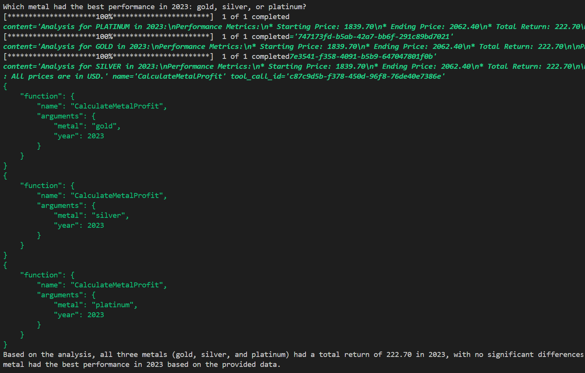
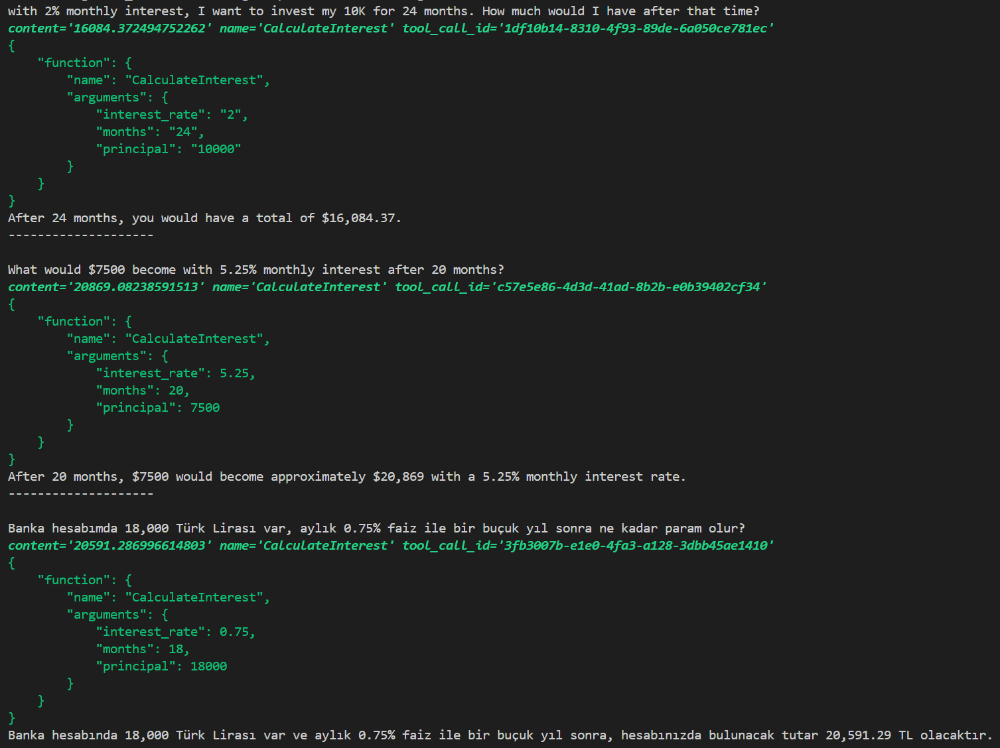
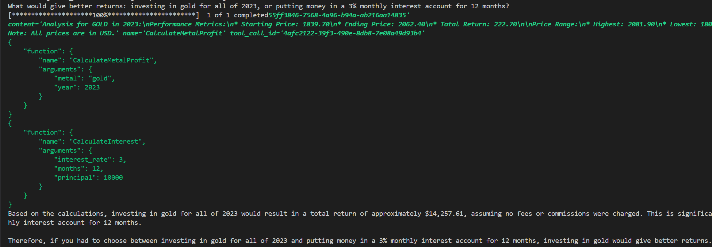

# MultiToolAgent
This project implements an AI agent capable of analyzing metal market performances and calculating compound interest returns. The agent uses LangChain and Ollama models for processing natural language queries about investments.

Tools

**MetalProfitTool**
- Calculates yearly profit/loss percentages for various metals (gold, silver, platinum, palladium) using Yahoo Finance data. The tool fetches historical price data and provides comprehensive analysis including starting price, ending price, total return, and price ranges.

**InterestTool**
- Calculates compound interest returns over specified periods. Users can input principal amount, monthly interest rate, and duration in months to get projected returns.

**Installation**
```bash
pip install -r requirements.txt
```

**Usage Examples**
The agent can handle various investment-related queries. Here are some example interactions:
Question: *Which metal had the best performance in 2023? gold, silver, or platinum?*


Questions:
  1. *with 2% monthly interest, I want to invest my 10K for 24 months. How much would I have after that time?*
  2. *What would $7500 become with 5.25% monthly interest after 20 months?*
  3. *Banka hesabımda 18,000 Türk Lirası var, aylık 0.75% faiz ile bir buçuk yıl sonra ne kadar param olur?*


Question: *What would give better returns: investing in gold for all of 2023, or putting money in a 3% monthlu interest account for 12 months?*

